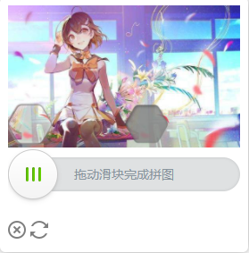
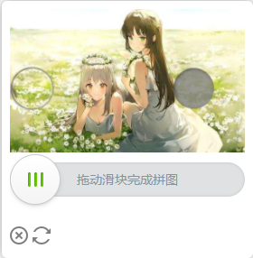
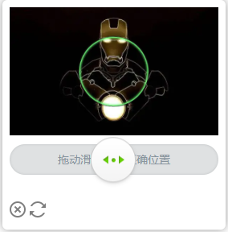

这是一个滑块验证码的实现

## [在线体验](https://www.tianai.cloud)

## 验证码demo移步 [tianai-captcha-demo](https://gitee.com/tianai/tianai-captcha-demo)






- 该滑块验证码实现了 普通图片和 **webp**图片两种格式
- java获取滑块验证码例子

## 快速上手

-

如果是SpringBoot开发者可直接使用SpringBoot快速启动器[tianai-captcha-springboot-starter](https://gitee.com/tianai/tianai-captcha-springboot-starter)

### 1. 导入xml

```xml
<!-- maven 导入 -->
<dependency>
    <groupId>cloud.tianai.captcha</groupId>
    <artifactId>tianai-captcha</artifactId>
    <version>1.3.0.RELEASE</version>
</dependency>
```

### 2. 使用 `SliderCaptchaGenerator`生成器生成滑块验证码

```java
import cloud.tianai.captcha.template.slider.generator.impl.StandardImageCaptchaGenerator;
import cloud.tianai.captcha.template.slider.generator.impl.StandardSliderCaptchaGenerator;
import cloud.tianai.captcha.template.slider.resource.SliderCaptchaResourceManager;
import cloud.tianai.captcha.template.slider.resource.impl.DefaultSliderCaptchaResourceManager;

public class Test {
    public static void main(String[] args) throws InterruptedException {
        SliderCaptchaResourceManager sliderCaptchaResourceManager = new DefaultSliderCaptchaResourceManager();
        StandardImageCaptchaGenerator sliderCaptchaGenerator = new StandardImageCaptchaGenerator(sliderCaptchaResourceManager, true);
        // 生成滑块图片
        SliderCaptchaInfo slideImageInfo = sliderCaptchaGenerator.generateCaptchaImage();
        System.out.println(slideImageInfo);

        // 负责计算一些数据存到缓存中，用于校验使用
        // SliderCaptchaValidator负责校验用户滑动滑块是否正确和生成滑块的一些校验数据; 比如滑块到凹槽的百分比值
        SliderCaptchaValidator sliderCaptchaValidator = new BasicCaptchaTrackValidator();
        // 这个map数据应该存到缓存中，校验的时候需要用到该数据
        Map<String, Object> map = sliderCaptchaValidator.generateSliderCaptchaValidData(slideImageInfo);
    }
}
```

### 3. 使用`SliderCaptchaValidator`校验器 验证

```java
import cloud.tianai.captcha.template.slider.generator.ImageCaptchaGenerator;
import cloud.tianai.captcha.template.slider.generator.SliderCaptchaGenerator;

public class Test2 {
    public static void main(String[] args) {
        ImageCaptchaGenerator sliderCaptchaValidator = new BasicCaptchaTrackValidator();

        // 用户传来的行为轨迹和进行校验 
        // - sliderCaptchaTrack为前端传来的滑动轨迹数据
        // - map 为生成验证码时缓存的map数据
        boolean check = sliderCaptchaValidator.valid(sliderCaptchaTrack, map);
        // 如果只想校验用户是否滑到指定凹槽即可，也可以使用
        // - 参数1 用户传来的百分比数据
        // - 参数2 生成滑块是真实的百分比数据
        check = sliderCaptchaValidator.checkPercentage(0.2f, percentage);
    }
}
```

## 整体架构设计

> tianai-captcha 验证码整体分为 生成器(`SliderCaptchaGenerator`)、校验器(`SliderCaptchaValidato`r)、资源管理器(`SliderCaptchaResourceManager`)
> 其中生成器、校验器、资源管理器等都是基于接口模式实现 可插拔的，可以替换为自定义实现，灵活度高

- 生成器(`SliderCaptchaGenerator`)
    - 主要负责生成滑块验证码所需的图片
- 校验器(`SliderCaptchaValidator`)
    - 主要负责校验用户滑动的行为轨迹是否合规
- 资源管理器(`SliderCaptchaResourceManager`)
    - 主要负责读取验证码背景图片和模板图片等
    - 资源管理器细分为 资源存储(`ResourceStore`)、资源提供者(`ResourceProvider`)
        - 资源存储(`ResourceStore`) 负责存储背景图和模板图
        - 资源提供者(`ResourceProvider`) 负责将资源存储器中对应的资源转换为文件流
            - 一般资源存储器中存储的是图片的url地址或者id之类， 资源提供者 就是负责将url或者别的id转换为真正的图片文件

## 扩展
### 生成带有混淆滑块的图片

```java
public class Test {
    public static void main(String[] args) {
        // 资源管理器
        SliderCaptchaResourceManager sliderCaptchaResourceManager = new DefaultSliderCaptchaResourceManager();
        // 标准验证码生成器
        StandardSliderCaptchaGenerator sliderCaptchaGenerator = new StandardSliderCaptchaGenerator(sliderCaptchaResourceManager, true);
        // 生成滑块图片
        SliderCaptchaInfo slideImageInfo = sliderCaptchaGenerator.generateSlideImageInfo(GenerateParam.builder()
                .sliderFormatName("jpeg")
                .backgroundFormatName("png")
                // 是否添加混淆滑块
                .obfuscate(true)
                .build());
    }
}
```

### 生成webp格式的滑块图片

```java
public class Test {
    public static void main(String[] args) {
        // 资源管理器
        SliderCaptchaResourceManager sliderCaptchaResourceManager = new DefaultSliderCaptchaResourceManager();
        // 标准验证码生成器
        StandardSliderCaptchaGenerator sliderCaptchaGenerator = new StandardSliderCaptchaGenerator(sliderCaptchaResourceManager, true);
        // 生成滑块图片
        SliderCaptchaInfo slideImageInfo = sliderCaptchaGenerator.generateSlideImageInfo(GenerateParam.builder()
                .sliderFormatName("webp")
                .backgroundFormatName("webp")
                // 是否添加混淆滑块
                .obfuscate(false)
                .build());
    }
}
```

### 添加自定义图片资源

- 自定义图片资源大小为 590*360 格式为jpg

```java
 public class Test {
    public static void main(String[] args) {
        // 通过资源管理器或者资源存储器
        ResourceStore resourceStore = sliderCaptchaResourceManager.getResourceStore();
        // 添加classpath目录下的 aa.jpg 图片      
        resourceStore.addResource(new Resource(ClassPathResourceProvider.NAME, "/aa.jpg"));
        // 添加远程url图片资源
        resourceStore.addResource(new Resource(URLResourceProvider.NAME, "http://www.xx.com/aa.jpg"));
        // 内置了通过url 和 classpath读取图片资源，如果想扩展可实现 ResourceProvider 接口，进行自定义扩展
    }
}
```

### 添加自定义模板资源

- 系统内置了2套模板，可以到QQ群:1021884609 文件中获取更多模板或者自己制作模板
- 模板图片格式
    - 滑块大小为 110*110 格式为png
    - 凹槽大小为 110*110 格式为png
    - 模板大小为 110*360 格式为png，该图为固定格式，是一张纯透明图片

```java
 public class Test {
    public static void main(String[] args) {
        // 通过资源管理器或者资源存储器
        ResourceStore resourceStore = sliderCaptchaResourceManager.getResourceStore();
        // 添加模板.模板图片由三张图片组成
        Map<String, Resource> template1 = new HashMap<>(4);
        template1.put(SliderCaptchaConstant.TEMPLATE_ACTIVE_IMAGE_NAME, new Resource(ClassPathResourceProvider.NAME, "/active.png"));
        template1.put(SliderCaptchaConstant.TEMPLATE_FIXED_IMAGE_NAME, new Resource(ClassPathResourceProvider.NAME, "/fixed.png"));
        template1.put(SliderCaptchaConstant.TEMPLATE_MATRIX_IMAGE_NAME, new Resource(ClassPathResourceProvider.NAME, "/matrix.png"));
        resourceStore.addTemplate(template1);
        // 模板与三张图片组成 滑块、凹槽、背景图 
        // 同样默认支持 classpath 和 url 两种获取图片资源， 如果想扩展可实现 ResourceProvider 接口，进行自定义扩展
    }
}
```

- 清除内置的图片资源和模板资源

 ```java
public class Test {
    public static void main(String[] args) {
        //为方便快速上手 系统本身自带了一张图片和两套滑块模板，如果不想用系统自带的可以不让它加载系统自带的
        // 第二个构造参数设置为false时将不加载默认的图片和模板
        SliderCaptchaGenerator sliderCaptchaGenerator = new StandardSliderCaptchaGenerator(sliderCaptchaResourceManager, false);
    }
}
 ```

### 自定义 `SliderCaptchaValidator` 校验器

```java
// 该接口负责对用户滑动验证码后传回的数据进行校验，比如滑块是否滑到指定位置，滑块行为轨迹是否正常等等
// 该接口的默认实现有 
// SimpleSliderCaptchaValidator 校验用户是否滑到了指定缺口处
// BasicCaptchaTrackValidator 是对 SimpleSliderCaptchaValidator增强
// BasicCaptchaTrackValidator是对SimpleSliderCaptchaValidator的增强 对滑动轨迹进行了简单的验证
// 友情提示 因为BasicCaptchaTrackValidator 里面校验滑动轨迹的算法已经开源，有强制要求的建议重写该接口的方法，避免被破解
```

### 自定义 `ResourceProvider` 实现自定义文件读取策略， 比如 oss之类的

```java
 public class Test {
    public static void main(String[] args) {
        // 实现了 ResourceProvider 后
        SliderCaptchaResourceManager sliderCaptchaResourceManager = new DefaultSliderCaptchaResourceManager();
        StandardSliderCaptchaGenerator sliderCaptchaGenerator = new StandardSliderCaptchaGenerator(sliderCaptchaResourceManager, true);
        // 注册
        sliderCaptchaResourceManager.registerResourceProvider(new CustomResourceProvider());
    }
}
```

### 扩展，对`StandardSliderCaptchaGenerator`增加了缓存模块

> 由于实时生成滑块图片可能会有一点性能影响，内部基于`StandardSliderCaptchaGenerator`进行了提前缓存生成好的图片，`CacheSliderCaptchaGenerator` 这只是基本的缓存逻辑，比较简单，用户可以定义一些更加有意思的扩展，用于突破性能瓶颈

```java
public class Test {
    public static void main(String[] args) throws InterruptedException {
        // 使用 CacheSliderCaptchaGenerator 对滑块验证码进行缓存，使其提前生成滑块图片
        // 参数一: 真正实现 滑块的 SliderCaptchaGenerator
        // 参数二: 默认提前缓存多少个
        // 参数三: 出错后 等待xx时间再进行生成
        // 参数四: 检查时间间隔    
        SliderCaptchaResourceManager sliderCaptchaResourceManager = new DefaultSliderCaptchaResourceManager();
        SliderCaptchaGenerator sliderCaptchaGenerator = new CacheSliderCaptchaGenerator(new StandardSliderCaptchaGenerator(sliderCaptchaResourceManager, true), 10, 1000, 100);
        // 生成滑块图片
        SliderCaptchaInfo slideImageInfo = sliderCaptchaGenerator.generateSlideImageInfo();
        // 获取背景图片的base64
        String backgroundImage = slideImageInfo.getBackgroundImage();
        // 获取滑块图片
        slideImageInfo.getSliderImage();
        System.out.println(slideImageInfo);
    }
}
```

# qq群: 1021884609