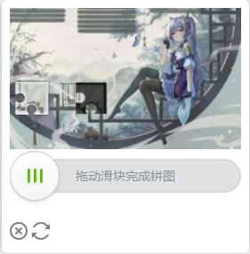
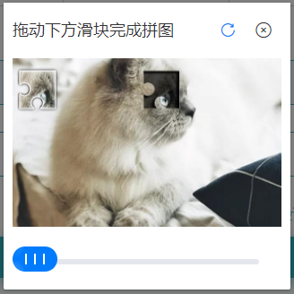
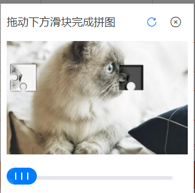

# 这是一个滑块验证码的实现
## 在线体验[点击前往](http://101.42.239.82:8080/)
## 验证码demo移步 [tianai-captcha-demo](https://gitee.com/tianai/tianai-captcha-demo)
## 不说废话，直接上成品




- 该滑块验证码实现了 普通图片和 **webp**图片两种格式
- java获取滑块验证码例子


##  快速上手
- 如果是SpringBoot开发者可直接使用SpringBoot快速启动器[tianai-captcha-springboot-starter](https://gitee.com/tianai/tianai-captcha-springboot-starter)
1. 导入xml
```xml
    <!-- maven 导入 -->
    <dependency>
        <groupId>cloud.tianai.captcha</groupId>
        <artifactId>tianai-captcha</artifactId>
        <version>1.2.3</version>
    </dependency>
```
2. 使用 `SliderCaptchaTemplate`获取滑块验证码
```java
public static void main(String[] args) throws InterruptedException {
    SliderCaptchaResourceManager sliderCaptchaResourceManager = new DefaultSliderCaptchaResourceManager();
    DefaultSliderCaptchaTemplate sliderCaptchaTemplate = new DefaultSliderCaptchaTemplate(sliderCaptchaResourceManager, true);
    // 生成滑块图片
    SliderCaptchaInfo slideImageInfo = sliderCaptchaTemplate.getSlideImageInfo();
    // 获取背景图片的base64
    String backgroundImage = slideImageInfo.getBackgroundImage();
    // 获取滑块图片
    slideImageInfo.getSliderImage();
    // 获取滑块被背景图片的百分比， (校验图片使用)
    Float xPercent = slideImageInfo.getXPercent();

    System.out.println(slideImageInfo);
}
```
# 常用接口
- 添加自定义图片资源
```java
  ResourceStore resourceStore = sliderCaptchaResourceManager.getResourceStore();=
  // 添加classpath目录下的 aa.jpg 图片      
  resourceStore.addResource(new Resource(ClassPathResourceProvider.NAME, "/aa.jpg"));
  // 添加远程url图片资源
  resourceStore.addResource(new Resource(URLResourceProvider.NAME, "http://www.xx.com/aa.jpg"));
  // 内置了通过url 和 classpath读取图片资源，如果想扩展可实现 ResourceProvider 接口，进行自定义扩展
```
- 添加自定义模板资源
```java
  ResourceStore resourceStore = sliderCaptchaResourceManager.getResourceStore();=
  Map<String, Resource> template1 = new HashMap<>(4);
  template1.put(SliderCaptchaConstant.TEMPLATE_ACTIVE_IMAGE_NAME, new Resource(ClassPathResourceProvider.NAME,"/active.png"));
  template1.put(SliderCaptchaConstant.TEMPLATE_FIXED_IMAGE_NAME, new Resource(ClassPathResourceProvider.NAME, "/fixed.png"));
  template1.put(SliderCaptchaConstant.TEMPLATE_MATRIX_IMAGE_NAME, new Resource(ClassPathResourceProvider.NAME, "/matrix.png"));
  resourceStore.addTemplate(template1);

  // 模板与三张图片组成 滑块、凹槽、背景图 
  // 同样默认支持 classpath 和 url 两种获取图片资源， 如果想扩展可实现 ResourceProvider 接口，进行自定义扩展
```
- 清除内置的图片资源和模板资源
 ```java
    //为方便快速上手 系统本身自带了一张图片和两套滑块模板，如果不想用系统自带的可以不让它加载系统自带的
    // 第二个构造参数设置为false时将不加载默认的图片和模板
    SliderCaptchaTemplate sliderCaptchaTemplate = new DefaultSliderCaptchaTemplate(sliderCaptchaResourceManager, false);
```
- 扩展，对`DefaultSliderCaptchaTemplate`增加了缓存模块
```java
public static void main(String[] args) throws InterruptedException {
    // 使用 CacheSliderCaptchaTemplate 对滑块验证码进行缓存，使其提前生成滑块图片
    // 参数一: 真正实现 滑块的 SliderCaptchaTemplate
    // 参数二: 默认提前缓存多少个
    // 参数三: 出错后 等待xx时间再进行生成
    // 参数四: 检查时间间隔    
    SliderCaptchaResourceManager sliderCaptchaResourceManager = new DefaultSliderCaptchaResourceManager();
    DefaultSliderCaptchaTemplate sliderCaptchaTemplate = new CacheSliderCaptchaTemplate(new DefaultSliderCaptchaTemplate(sliderCaptchaResourceManager, true), 10, 1000, 100);
    // 生成滑块图片
    SliderCaptchaInfo slideImageInfo = sliderCaptchaTemplate.getSlideImageInfo();
    // 获取背景图片的base64
    String backgroundImage = slideImageInfo.getBackgroundImage();
    // 获取滑块图片
    slideImageInfo.getSliderImage();
    // 获取滑块被背景图片的百分比， (校验图片使用)
    Float xPercent = slideImageInfo.getXPercent();

    System.out.println(slideImageInfo);
}
```
- 自定义 `ResourceProvider` 实现自定义文件读取策略， 比如 oss之类的

```java
  // 实现了 ResourceProvider 后
  SliderCaptchaResourceManager sliderCaptchaResourceManager = new DefaultSliderCaptchaResourceManager();
  DefaultSliderCaptchaTemplate sliderCaptchaTemplate = new DefaultSliderCaptchaTemplate(sliderCaptchaResourceManager, true);
  // 注册
  sliderCaptchaResourceManager.registerResourceProvider(new CustomResourceProvider());
```
- qq群: 1021884609